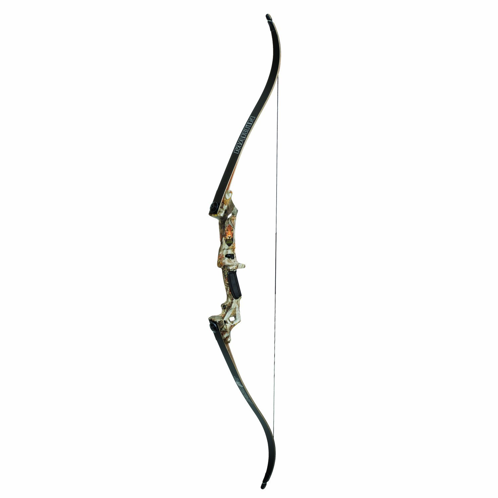
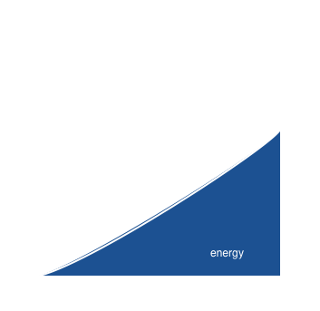
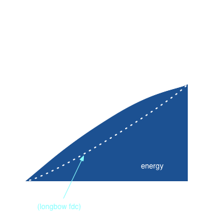
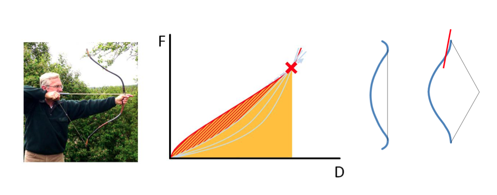

### Recurve Bow

**Theory**

1. What is a recurve bow?
2. Why is a recurve bow better?
3. Arrow speed of recurve bow.
4. Force needed to draw the bow. The curve is important so check it, in theory.
4. How to aim?
4. Time needed for the arrow to fly away from the bow which is important because basically you can't move the bow during this time interval.

My bow:

* Martin Jaguar Takedown Bow, 45#

#### ToC

1. [Draw-Force Curve of Bows](#draw-force-curve-of-bows)
2. 

#### Draw-Force Curve of Bows

The draw-force curve of ordinary bows is something like

which tells that the more we draw, the larger the force is. However, a recurve bow behaves like

where the increasing rate of force drops starting from some draw distance.

These two images are from this page [archery](http://billhails.net/archery.html).

This is extraordinary because we usually draw the bow to the max point and stay there for several seconds. If the force does't increase so much it's much easier to keep on that draw length.

However what we care the most is the energy the arrow. Loosely speaking, the energy of the arrow is the work done by the string, which is the area under the draw force curve.

So it's clear that recurve bows can shoot the arrow at a more powerful speed than ordinary bows at the same draw force because it has more area under the curve.

Then the question is why recurve bow can achieve this. All the reason comes from the **recurve** design. Here is a figure about recurve bow (ref. [Fundamentals of the Design of Olympic Recurve Bows](http://www.ocf.berkeley.edu/~archery/wp-content/uploads/2011/08/Fundamentals-of-the-Design-of-Olympic-Recurve-Bows.pdf)).

(It's college physics by the way.)

#### How to Stand

The stance is very important to keep the archer steady.

1. Square stance
2. Open stance

#### How to Draw

Relax you both hands.

Elbow of the holding arm should not stay on the path of the string.
